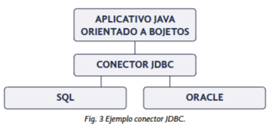

# Tema 4: Manejo de Conectores I (JDBC en Java)

---

## 1️⃣ Introducción
En este tema aprenderás a **conectar una aplicación Java con una base de datos** usando **JDBC (Java Database Connectivity)**.  
Se estudian los **tipos de conectores**, el **desfase objeto-relacional**, y cómo realizar operaciones con la clase `DriverManager`.

💡 **Objetivos del tema:**
- Comprender el concepto de **conector JDBC**.  
- Conocer los **protocolos JDBC y ODBC**.  
- Aprender a **configurar conexiones** a base de datos.  
- Realizar operaciones CRUD (Create, Read, Update, Delete) con código Java.

---

## 2️⃣ Introducción al manejo de conectores

### 2.1. El Desfase Objeto–Relacional

El **desfase objeto–relacional** aparece cuando una aplicación orientada a objetos (Java) interactúa con una **base de datos relacional**.  
Las estructuras de datos no siempre coinciden, por lo que se necesita un conector que traduzca ambos mundos.

📘 **Ejemplo:**
- En Java usamos **clases y objetos**.  
- En la base de datos usamos **tablas y registros**.

El **conector JDBC** se encarga de traducir estos objetos a datos relacionales (filas y columnas).

---

### 2.2. Protocolos de Acceso a Base de Datos
Los principales protocolos son:

| Protocolo | Desarrollado por | Uso |
|------------|------------------|-----|
| **JDBC (Java Database Connectivity)** | Sun Microsystems | Conectar Java a bases de datos. |
| **ODBC (Open Database Connectivity)** | Microsoft | Conexiones universales en Windows. |

👉 JDBC es el estándar en Java y el más usado actualmente. 



---
## 3️⃣ Conexiones: Componentes y tipos
4️⃣5️⃣

### 3.1. Componentes del Conector JDBC

1. **API JDBC** → Librerías y clases de `java.sql` y `javax.sql` para acceder a bases de datos.  
2. **Gestor JDBC** → Intermediario entre la aplicación y el driver.  
3. **Driver JDBC** → Implementación específica para cada base de datos (MySQL, Oracle, PostgreSQL...).  
4. **Puente JDBC-ODBC** → Permite usar drivers ODBC como si fueran JDBC.

**Arquitecturas:**
- **Dos capas** = conexión directa (aplicación ↔ base de datos).
- **Tres capas** = conexión indirecta (aplicación ↔ middleware ↔ base de datos).

---

### 3.2. Tipos de Drivers JDBC

| Tipo | Descripción | Características |
|------|--------------|-----------------|
| **Tipo 1: JDBC-ODBC** | Usa puente ODBC. | Obsoleto, lento, multiplataforma limitada. |
| **Tipo 2: Nativo** | Parte Java, parte código nativo. | Rápido pero dependiente del sistema. |
| **Tipo 3: Net** | Comunicación mediante middleware. | Flexible y escalable. |
| **Tipo 4: Protocolo Nativo** | Implementado 100% en Java. | Más usado, portable, rápido. |

👉 En resumen:

- Para aplicaciones simples → dos capas (cliente + BDD)
- Para aplicaciones grandes o con muchas consultas → tres capas (cliente + middleware + BDD)

---

### 5️⃣ Conexión en Código Java
Para conectar Java con una base de datos se necesita:

1. **Descargar el driver JDBC (.jar)** del motor de base de datos.  
2. **Añadirlo al classpath del proyecto.**  
3. **Definir variables de conexión.**  

📘 **Ejemplo básico:**
```java
private static final String DRIVER = "com.mysql.cj.jdbc.Driver";
private static final String URL = "jdbc:mysql://localhost:3306/empresa";
private static final String USUARIO = "root";
private static final String PASSWORD = "1234";

public static Connection getConnection() throws SQLException, ClassNotFoundException {
    Class.forName(DRIVER);
    return DriverManager.getConnection(URL, USUARIO, PASSWORD);
}
```

---

### 7️⃣ Ejemplo CRUD Completo (Java + JDBC)

Este ejemplo muestra cómo realizar operaciones **Create, Read, Update y Delete** sobre una tabla `clientes`.

#### 🧩 Estructura de la tabla
```sql
CREATE TABLE clientes (
  id INT AUTO_INCREMENT PRIMARY KEY,
  nombre VARCHAR(50),
  ciudad VARCHAR(50),
  edad INT
);
```

#### 📘 Clase de Conexión
```java
import java.sql.*;

public class ConexionDB {
    private static final String URL = "jdbc:mysql://localhost:3306/empresa";
    private static final String USER = "root";
    private static final String PASSWORD = "1234";

    public static Connection conectar() {
        try {
            Class.forName("com.mysql.cj.jdbc.Driver");
            return DriverManager.getConnection(URL, USER, PASSWORD);
        } catch (Exception e) {
            e.printStackTrace();
            return null;
        }
    }
}
```

---

#### 🟩 CREATE – Insertar datos
```java
Connection con = ConexionDB.conectar();
String sql = "INSERT INTO clientes (nombre, ciudad, edad) VALUES (?, ?, ?)";
PreparedStatement ps = con.prepareStatement(sql);
ps.setString(1, "Lucía");
ps.setString(2, "Sevilla");
ps.setInt(3, 28);
ps.executeUpdate();
System.out.println("Registro insertado correctamente");
```

---

#### 🟦 READ – Consultar datos
```java
Statement st = con.createStatement();
ResultSet rs = st.executeQuery("SELECT * FROM clientes");
while (rs.next()) {
    System.out.println(rs.getInt("id") + " - " + rs.getString("nombre") + 
                       " - " + rs.getString("ciudad") + " - " + rs.getInt("edad"));
}
```

---

#### 🟨 UPDATE – Modificar datos
```java
String updateSQL = "UPDATE clientes SET ciudad=? WHERE id=?";
PreparedStatement ps2 = con.prepareStatement(updateSQL);
ps2.setString(1, "Málaga");
ps2.setInt(2, 1);
int filas = ps2.executeUpdate();
System.out.println(filas + " registro(s) actualizado(s)");
```

---

#### 🟥 DELETE – Eliminar datos
```java
String deleteSQL = "DELETE FROM clientes WHERE id=?";
PreparedStatement ps3 = con.prepareStatement(deleteSQL);
ps3.setInt(1, 1);
int borrados = ps3.executeUpdate();
System.out.println(borrados + " registro(s) eliminado(s)");
```

---

### 8️⃣ Excepciones y Cierre de Conexiones
Siempre se deben cerrar las conexiones para liberar recursos.

```java
finally {
    try {
        if (ps != null) ps.close();
        if (con != null) con.close();
    } catch (SQLException e) {
        e.printStackTrace();
    }
}
```

---

### 9️⃣ Ventajas e Inconvenientes de los Conectores
| Tipo | Ventajas | Inconvenientes |
|------|-----------|----------------|
| **Tipo 1** | Incluido en Java, fácil de usar. | Lento, dependiente de ODBC. |
| **Tipo 2** | Rápido, acceso nativo. | No multiplataforma. |
| **Tipo 3** | Escalable, ideal para internet. | Necesita middleware. |
| **Tipo 4** | 100% Java, portable y eficiente. | Requiere driver por base de datos. |

---

### 🔢 Resumen del Tema
✅ Conceptos clave:
- El conector **JDBC** permite comunicar Java con bases de datos.  
- Existen distintos tipos de drivers (1–4).  
- `DriverManager` gestiona las conexiones.  
- Se pueden ejecutar sentencias SQL con `Statement` y `PreparedStatement`.  
- Se realizó un **CRUD completo** para manipular datos desde Java.

---

### 🔗 Webgrafía
- [Documentación JDBC – Oracle](https://docs.oracle.com/javase/8/docs/api/java/sql/package-summary.html)  
- [Ejemplo de conexión JDBC en Java – decodigo.com](http://decodigo.com/java-conexion-a-base-de-datos-con-jdbc)

---

